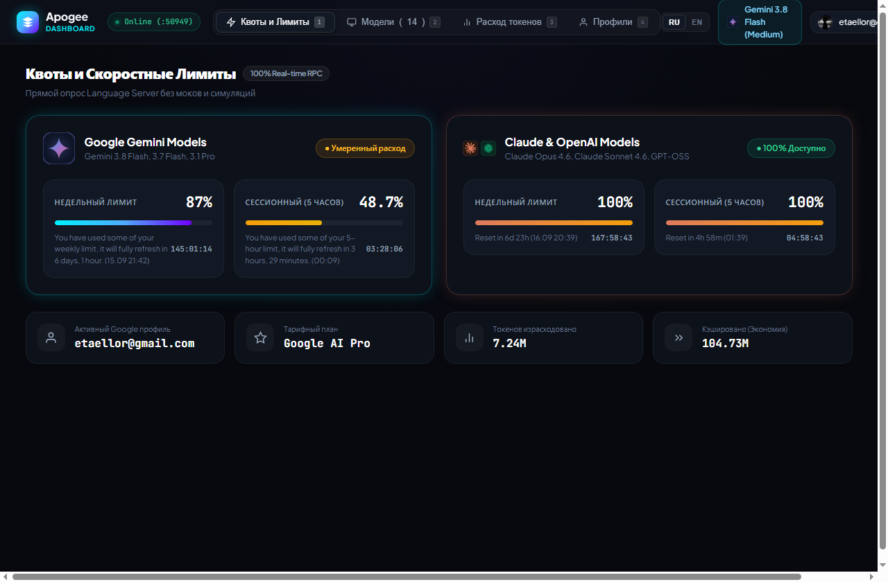
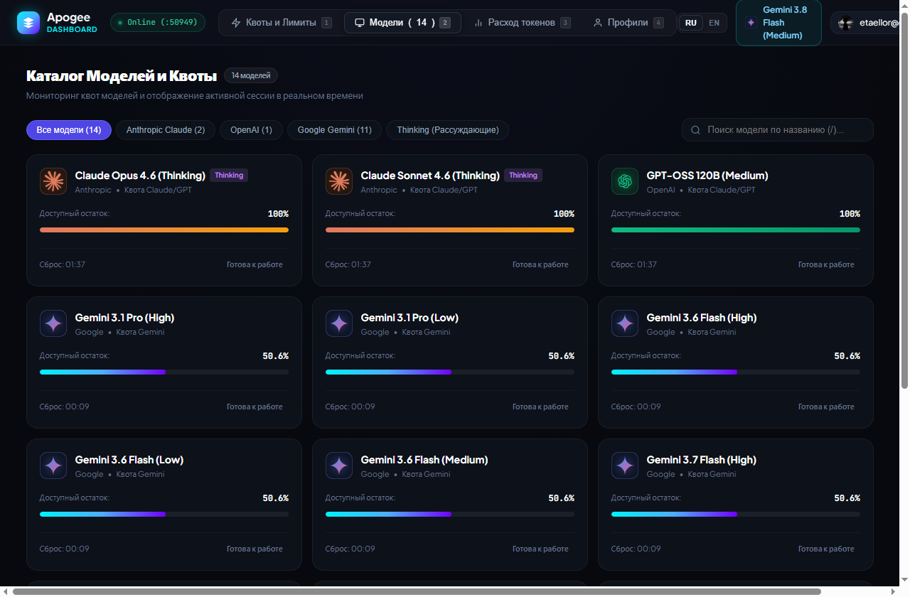
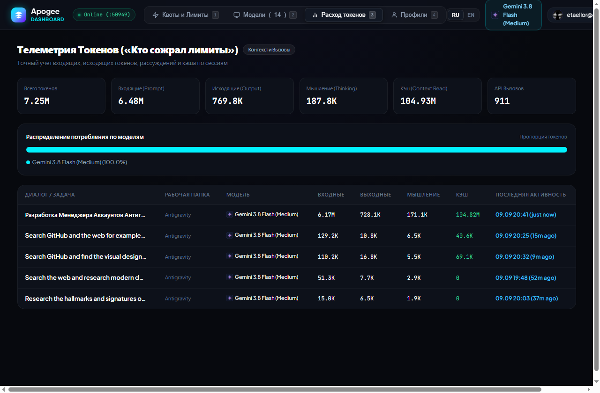

<p align="center">
  <br>
  <pre align="center">
<b>
   █████╗ ██████╗  ██████╗  ██████╗ ███████╗███████╗
  ██╔══██╗██╔══██╗██╔═══██╗██╔════╝ ██╔════╝██╔════╝
  ███████║██████╔╝██║   ██║██║  ███╗█████╗  █████╗  
  ██╔══██║██╔═══╝ ██║   ██║██║   ██║██╔══╝  ██╔══╝  
  ██║  ██║██║     ╚██████╔╝╚██████╔╝███████╗███████╗
  ╚═╝  ╚═╝╚═╝      ╚═════╝  ╚═════╝ ╚══════╝╚══════╝
</b>
  </pre>
  <h1 align="center">Apogee — Antigravity Manager</h1>
  <p align="center">
    <strong>Zero-dependency local dashboard, real-time quota telemetry & active session tracker for Google Antigravity IDE.</strong>
  </p>
  <p align="center">
    <a href="LICENSE"></a>
    
    
    
    
  </p>
  <p align="center">
    <a href="#overview">Overview</a> &bull;
    <a href="#screenshots">Screenshots</a> &bull;
    <a href="#key-features">Key Features</a> &bull;
    <a href="#quickstart">Quickstart</a> &bull;
    <a href="#keyboard-shortcuts">Shortcuts</a> &bull;
    <a href="#how-it-works">How It Works</a> &bull;
    <a href="#architecture">Architecture</a> &bull;
    <a href="#license">License</a>
  </p>
</p>

---

## Overview

Google Antigravity coordinates language models through a background RPC daemon (`language_server.exe`). Rate limits are enforced on rolling weekly pools and 5-hour velocity windows across Gemini, Claude (Opus / Sonnet 4.6), and OpenAI (GPT-OSS).

Because the editor interface hides exact remaining percentages and token depletion curves, developers frequently hit rate limits mid-task without warning.

**Apogee** runs as a local, zero-dependency companion:
1. **True Quota Depletion**: Queries `language_server.exe` via gRPC-web for exact weekly and 5-hour quota fractions.
2. **Active Session Tracking**: Directly inspects running IDE trajectories to identify the active model currently processing tasks in real time.
3. **Session Token Accounting**: Parses conversation trajectories to show exact prompt, output, thinking, and cache savings per task.
4. **Multi-Account Profiles**: Interops with Windows Credential Manager (`wincred.dll` via `ctypes`) and OAuth2 to swap Google accounts securely.

---

## Screenshots

### 1. Live Quotas & Sliding Windows
*Real-time weekly and 5-hour quota pools queried directly from Language Server RPC.*
<p align="center">
  
</p>

### 2. Model Catalog & Quota Meters
*Individual model status, remaining percentages, and active session model indicators.*
<p align="center">
  
</p>

### 3. Session Token Telemetry
*Granular breakdown of prompt, completion, thinking tokens, and cache savings across workspace tasks.*
<p align="center">
  
</p>

---

## Key Features

<table>
  <tr>
    <td width="50%" valign="top">
      <h3>Live Quota Tracking</h3>
      <ul>
        <li><b>Zero Synthetic Data:</b> 100% genuine RPC polling via <code>RetrieveUserQuotaSummary</code>.</li>
        <li><b>Sliding Windows:</b> Independent weekly and 5-hour rate-limit meters.</li>
        <li><b>Reset Timers:</b> Live second-by-second countdown to quota replenishment.</li>
      </ul>
    </td>
    <td width="50%" valign="top">
      <h3>Model & Session Telemetry</h3>
      <ul>
        <li><b>Live Session Detection:</b> Inspects active cascade trajectories to display the current running model.</li>
        <li><b>Per-Model Quotas:</b> Real-time remaining percentages for Claude, Gemini, and GPT-OSS.</li>
        <li><b>Filter Chips:</b> Instant filtering by provider (Google, Anthropic, OpenAI) or reasoning/thinking.</li>
      </ul>
    </td>
  </tr>
  <tr>
    <td width="50%" valign="top">
      <h3>Token Accounting</h3>
      <ul>
        <li><b>Telemetry Engine:</b> Tracks prompt, output, thinking, and cache reads per conversation.</li>
        <li><b>Task Attribution:</b> See which workspace task consumed rate limits.</li>
        <li><b>Consumption Ratio:</b> Visual breakdown of token usage across models.</li>
      </ul>
    </td>
    <td width="50%" valign="top">
      <h3>Security & Multi-Profile</h3>
      <ul>
        <li><b>Windows Credential Manager:</b> Native <code>wincred.dll</code> ctypes integration.</li>
        <li><b>OAuth2 Auth Flow:</b> Connect multiple Google accounts securely.</li>
        <li><b>RPC Process Watchdog:</b> One-click respawn for unresponsive language server processes.</li>
      </ul>
    </td>
  </tr>
</table>

---

## Quickstart

Apogee requires **zero external pip dependencies** — it runs entirely on the standard Python 3.8+ library.

### Windows
Double-click `run.bat` or run:
```cmd
python server.py
```

### Linux / macOS
```bash
chmod +x run.sh
./run.sh
```

The web dashboard opens at:
```
http://127.0.0.1:28888/
```

### CLI Arguments

```text
usage: server.py [-h] [--port PORT] [--host HOST] [--no-browser]

options:
  --port PORT     Server port (default: 28888)
  --host HOST     Host address (default: 127.0.0.1)
  --no-browser    Do not open browser automatically on startup
```

---

## Keyboard Shortcuts

Apogee supports full single-key navigation:

| Key | Action |
|:---:|:---|
| `1` | Switch to Quotas & Velocity Limits tab |
| `2` | Switch to Model Catalog & Quotas tab |
| `3` | Switch to Token Telemetry tab |
| `4` | Switch to Google Profiles & Component Controls tab |
| `/` | Instant focus into Model Search box |
| `R` | Force refresh all metrics from Language Server RPC |

---

## How It Works

1. **Ephemeral Port Discovery**: Antigravity IDE launches `language_server.exe` with `--https_server_port 0`. Apogee detects the process PID, queries active listening sockets via `netstat`, and validates the HTTPS RPC port automatically.
2. **gRPC-web Length-Prefixed Unmarshalling**: Apogee communicates with native Connect/gRPC-web protocol using 5-byte frame prefixes (`Connect-Protocol-Version: 1`, `X-Codeium-Csrf-Token`).
3. **Active Trajectory Inspection**: Queries `GetAllCascadeTrajectories` and `GetCascadeTrajectory` to read generator metadata directly from active sessions, providing accurate model detection at any moment.
4. **Credential Isolation**: On Windows, authentication tokens are managed via Windows Credential Manager (`CredReadW` / `CredWriteW`), avoiding plaintext disk storage.

---

## Architecture

```text
apogee-antigravity-manager/
|-- server.py              # CLI entrypoint and HTTP API server
|-- core/
|   |-- client.py          # Language Server RPC & gRPC-web protocol client
|   |-- accounts.py        # Windows Credential Manager ctypes wrapper & OAuth
|   `-- telemetry.py       # Trajectory parser and token aggregator
|-- docs/
|   `-- screenshots/       # High-DPI UI preview captures
|-- web/
|   |-- index.html         # Dashboard markup
|   |-- css/style.css      # Dark-mode stylesheet
|   |-- js/app.js          # Client-side state, event handlers & i18n
|   `-- assets/            # Vector logos (Gemini, Claude, OpenAI)
|-- run.bat                # Windows quickstart launcher
|-- run.sh                 # Unix quickstart launcher
|-- LICENSE                # MIT License
|-- requirements.txt       # Optional dev dependencies
`-- pyproject.toml         # Packaging metadata
```

---

## License

Distributed under the [MIT License](LICENSE).
